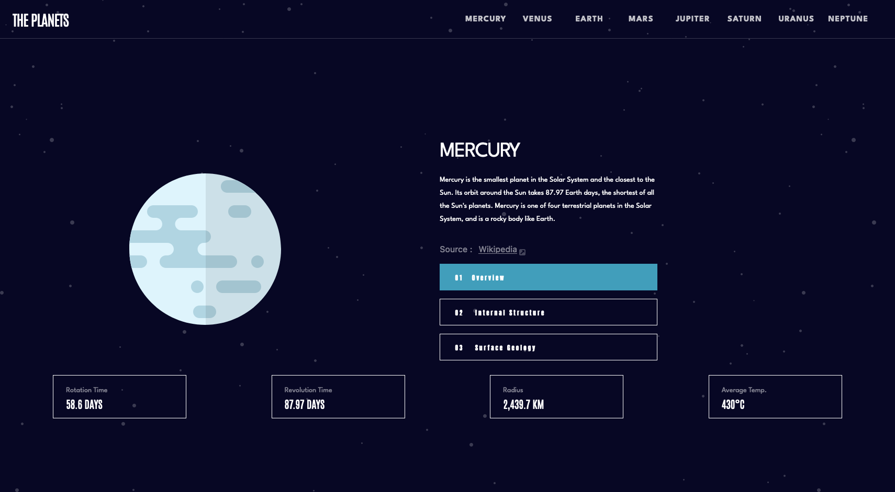
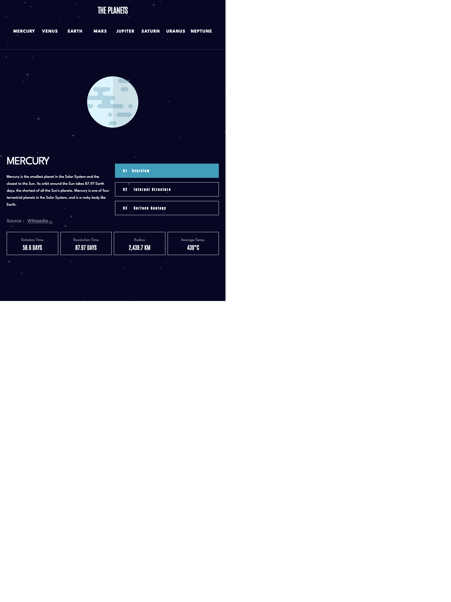
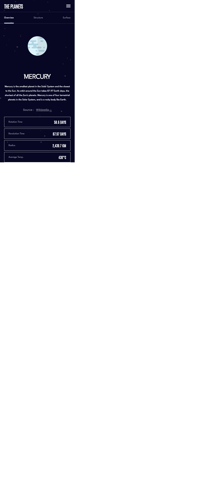

# Frontend Mentor - Planets fact site solution

This is a solution to the [Planets fact site challenge on Frontend Mentor](https://www.frontendmentor.io/challenges/planets-fact-site-gazqN8w_f). Frontend Mentor challenges help you improve your coding skills by building realistic projects. 

## Table of contents

- [Overview](#overview)
  - [The challenge](#the-challenge)
  - [Screenshot](#screenshot)
  - [Links](#links)
- [My process](#my-process)
  - [Built with](#built-with)
  - [What I learned](#what-i-learned)
  - [Continued development](#continued-development)
- [Author](#author)

## Overview

### The challenge

Users should be able to:

- View the optimal layout for the app depending on their device's screen size
- See hover states for all interactive elements on the page
- View each planet page and toggle between "Overview", "Internal Structure", and "Surface Geology"

### Screenshot

 Desktop View
 Tablet View
 Desktop View

### Links

- Solution URL: [Add solution URL here](https://github.com/barnettet31/planet-fact-ts-react)
- Live Site URL: [Add live site URL here](https://barnettet31.github.io/planet-fact-ts-react/)

## My process

I wanted to continue using tailwind and react in this project but add the slight difficulty of TS. So I created the project using the typescript template. 
Typescript is proving to be pretty difficult to get my mind wrapped around, and it's a 100% something I'm going to need to build a couple projects with before I understand it. 

### Built with

- Semantic HTML5 markup
- CSS custom properties
- Flexbox
- CSS Grid
- Mobile-first workflow
- [React](https://reactjs.org/) - JS library
- [TailwindCSS](https://tailwindcss.com/) - For styles
-[TypeScript](https://www.typescriptlang.org/) - For Type Safety

### What I learned
I learned that tailwind doesn't support dynamic creation of the classes with string interpolation so I had to write a couple of functions to return the desired colors, sizes etc. 

### Continued development
Somethings I would change if I could would be the image shifting the page when the geology tab is clicked, so I will need to look into maybe setting minimum heights on the containers in order to keep them consistently shaped. 

## Author

- Frontend Mentor - [@barnettet31](https://www.frontendmentor.io/profile/barnettet31)
- Twitter - [@barnette_travis5](https://twitter.com/barnett_travis5)
- LinkedIn - [@travis-barnette-ba7987237](https://www.linkedin.com/in/travis-barnette-ba7987237/)

